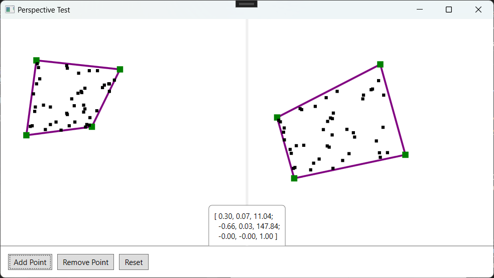

# PerspectiveTest

这是一个用于测试透视矩阵的小程序, 程序的左侧和右侧均有一个四边形选框, 下方是 "添加点", "移除点" 以及 "重置" 按钮, 
中间下方是从左侧四边形到右侧四边形变换的透视矩阵.

点击添加点可以向左侧四边形添加一个随机位置的点, 移除是删除最后添加的点, 重置则是删除所有点, 并将四边形选框重置到原始位置.

基于透视矩阵变换, 左侧选框中的点会映射到右侧选框中.

---

This is a small program used to test the perspective matrix. There is a quadrilateral selection box on both the left and right sides of the program, with buttons labeled 'Add Point,' 'Remove Point,' and 'Reset' below. In the lower middle, there is a perspective matrix that transforms the quadrilateral on the left into the one on the right.

Clicking 'Add Point' adds a point at a random position within the quadrilateral on the left. 'Remove' deletes the last added point, while 'Reset' removes all points and restores the quadrilateral selection boxes to their original positions.

Based on the perspective matrix transformation, points within the selection box on the left will be mapped to the selection box on the right

---

